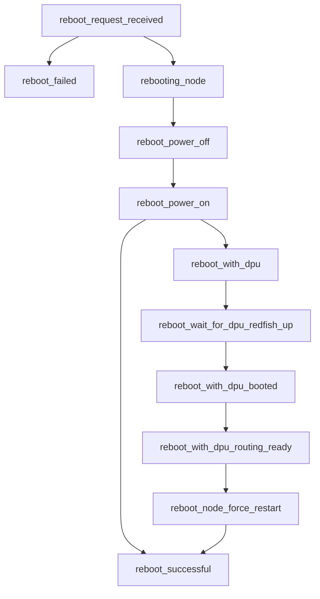

```mermaid
graph TB
      reboot_request_received --> reboot_failed
      reboot_request_received --> rebooting_node
      rebooting_node --> reboot_power_off
      reboot_power_off --> reboot_power_on
      reboot_power_on --> reboot_with_dpu
      reboot_power_on --> reboot_successful
      reboot_with_dpu --> reboot_wait_for_dpu_redfish_up
      reboot_wait_for_dpu_redfish_up --> reboot_with_dpu_booted
      reboot_with_dpu_booted --> reboot_with_dpu_routing_ready
      reboot_with_dpu_routing_ready --> reboot_node_force_restart
      reboot_node_force_restart --> reboot_successful
```